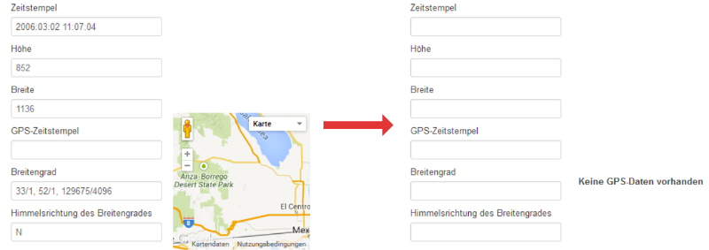
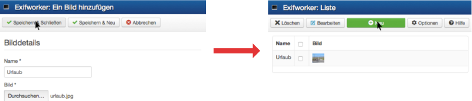
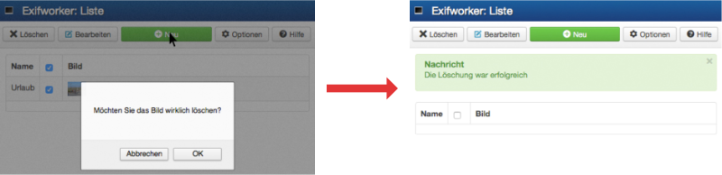

# EXIF Worker

**EXIF Worker** is a [Joomla!](https://www.joomla.org) component for viewing and manipulating [EXIF](https://exiftool.org/TagNames/EXIF.html) data of images to clean unintended stored metadata such as **date** and **location**.

## :dart: Features

* Adding and deleting images
* Viewing and manipulating EXIF data
* Use of edited images in posts
* Individual configuration of the component

## :rocket: Getting Started

### :wrench: Installation

In the following it is assumed that a web server exists where Joomla! and the PHP extension [Imagick](https://github.com/Imagick/imagick) are installed.

First, zip the directory *com_exifworker*. Second, go to the Joomla! extension menu and upload the created archive.

A message should then appear stating that the installation was completed successfully.

### :computer: Usage

Provided that the component has been installed successfully, EXIF Worker can be accessed via the corresponding item in the component menu. Among other things, here you can **add** and **delete** images to process EXIF data.

## :eyes: Examples

### :large_orange_diamond: Adding Image

To add an image to the media manager, go to the list of this component and click *Neu*. Then the desired image can be uploaded via *Durchsuchen*. This process is confirmed by clicking the button labeled *Speichern & Schließen*.

### :large_orange_diamond: Deleting Image

To delete an image, select an existing one and click the button labeled *Löschen*. Confirm this process with *OK*.

## :white_check_mark: Tests

This component was tested using several browsers, including Firefox and Safari. The focus here was on **UI tests** and **security tests**.

## :book: Documentation

The EXIF Worker documentation becomes available by using [phpDocumentor](https://www.phpdoc.org).

If you need help regarding the use of this component, there is the corresponding button labeled *Hilfe* in the Joomla! backend.

## :warning: License

EXIF Worker is licensed under the terms of the [MIT license](LICENSE.txt).
